# cba_final_project
Here we present code for our final project on Computational Biology of Aging course done by Mazalov Aleksei (PhD-1), Malygina Alexandra (MSc-2), Shipulina Eva (MSc-2). 
# ECM transcriptome dynamics during aging
## Introduction
The project centers on performing bioinformatic analysis of the changes in gene expression, that can be detected in aging humans. Firstly, we explore the common patterns in the gene expression changes observed in various tissues and perform functional enrichment analysis of differentially expressed gene lists. Following the workflow, described in [1], we aim to reproduce the previously reported results. This work is part of the endeavour to better understand the role of the extracellular matrix (ECM) in aging.   

Additionally, it would be interesting to find not only genes which expression change between three chosen age groups but also whole modules of genes which change together. It may help to highlight interesting findings in DE analysis, link them, adjust in silico experiments and come to biologically relevant conclusions being based on two different approaches.

## Results

## Reproducing the previous analysis
Firstly, we focused on studying the article [1] and reproducing the main results reported by the authors. Human transcriptomic data obtained via bulk RNA-seq sequencing of samples collected from 7 different tissues is the object of the analysis in [1]. To be able to reproduce the results as precisely as possible, we opted for the same bioinformatic tools as the ones reported to have been used in [1].
We also intended to apply the same filtering to determine which data will be included in our analysis. 

The data in analysis was obtained from [2] (the v8 section), and the corresponding metadata was downloaded from [3]. The metadata included the GTEx_Analysis_v8_Annotations_SampleAttributesDS.txt file (containing mainly sample related data, with the tissue provenance and the experiment type being the most important for our filtering) and the GTEx_Analysis_v8_Annotations_SubjectPhenotypesDS.txt (containing donor related metadata, such as age and sex).

To follow the workflow, reported in [1], we included only samples from the heart, blood, brain, liver, kidneys, lungs, and
skeleton muscles (the SMTS field in the GTEx_Analysis_v8_Annotations_SampleAttributesDS.txt file). For consistency with the paper of reference, we also performed additional filtering on the SMTSD field in the same file, keeping only samples with one of the following values for the mentioned attribute: 'Brain - Hippocampus', 'Brain - Cerebellum', 'Brain - Caudate (basal ganglia)', 'Brain - Putamen (basal ganglia)', 'Brain - Cortex'. We also included only 'Whole Blood' data to match the number of analyzed samples with the number of blood samples in the reference paper. We also limited our research to the RNASEQ samples (the SMAFRZE field) and filtered out the 'RNA isolation_PAXgene Tissue miRNA' samples (the SMNABTCHT field). We were left with 3214 samples, which is different from the 2717 samples reported in the article of reference.

The filtering results are summarized below. They are also compared with the filtering results reported in [1].

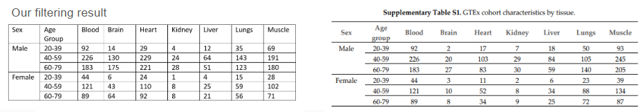

The donors were also stratified using the methodology proposed in the reference article, the didtinct age groups (stratas) being 20-39, 40-59 and 60-79 years old.

Gene annotations were obtained from [4], so that genes were classified as either "ECM" (aka "Core matrisome genes"), "Matrisome-associated" or "Other". Genes were subsequently characterized into subcategories as seen below.

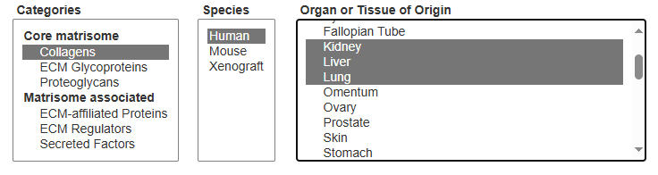

We further followed the standart EdgeR pipeline [5] for RNA-seq analysis, andat that stage we aimed mainly at finding the differentially expressed genes. The said analysis can be summarized by the schematic below. 

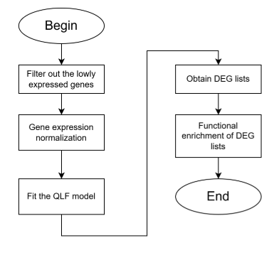

We also performed PCA analysis with the help of the same package, making use of CPM normalization.

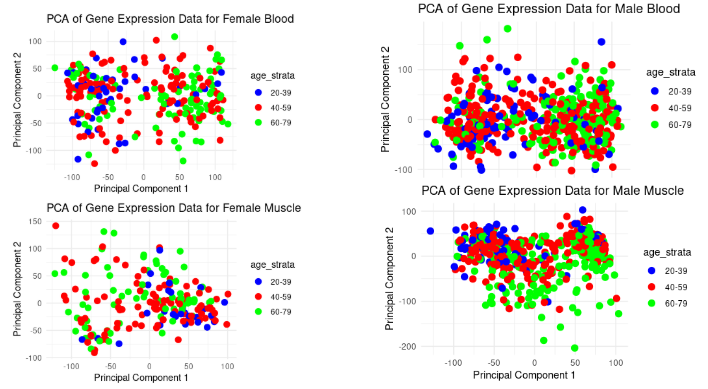

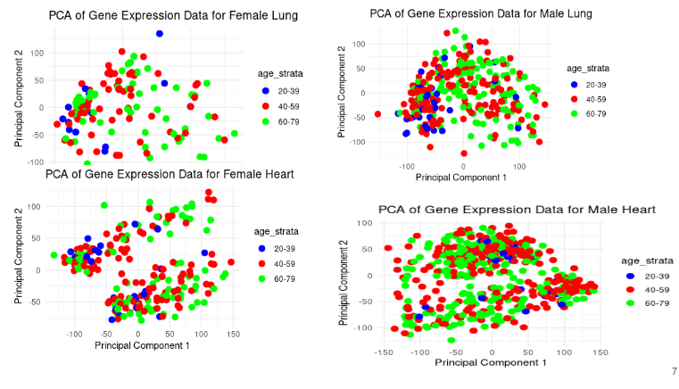

The results of the performed PCA analysis show that samples can indeed be separated by age strata. Of note, we do not include PCA analysis results for the remaining tissues here due to the low number of samples.  

The results of gene expression analysis are summarized in the following tables.

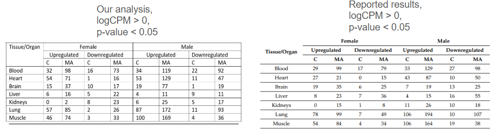

For female blood we obtained the following most important ECM DEGs.

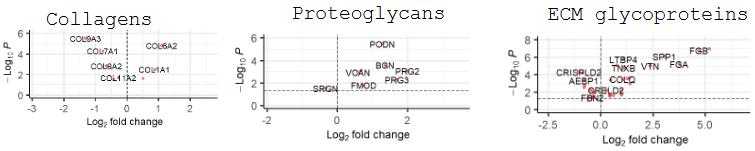

The result was almost identical to the one reported in [1].

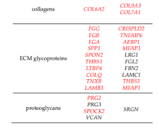

For male blood we obtained the following most important ECM DEGs.

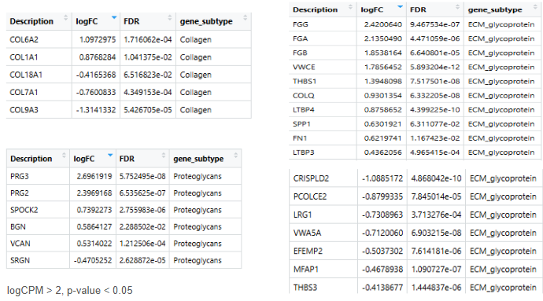

The result was almost identical to the one reported in [1].

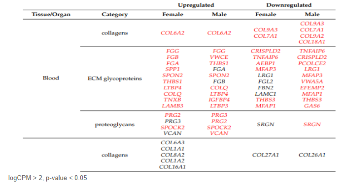

We also determined the genes upregulated or downregulated at least in 3 tissues.

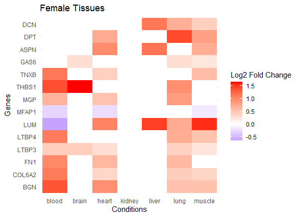

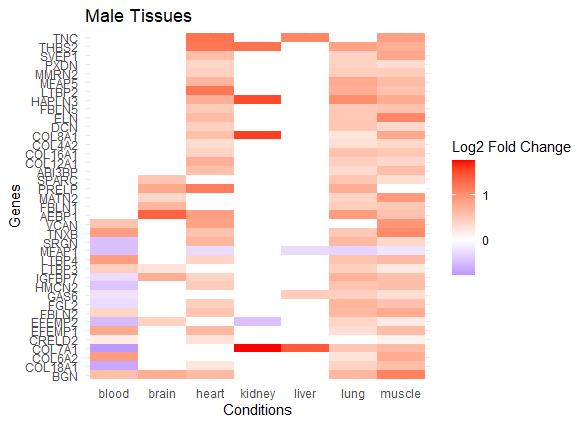

## WGCNA
The next stage of the project was to conduct WGCNA to find gene modules that change during ageing process. Due to technical reasons we used only samples from heart, liver and lung. 

The data were preprocessed: metadata was created based on GTEx Portal files: GTEx_Analysis_v8_Annotations_SubjectPhenotypesDS.txt and GTEx_Analysis_v8_Annotations_SampleAttributesDS.txt; after sample filtration gene filtration was performed: min 70 counts per a sample; DESeq normalization was performed as well as variance stabilizing transformation. Then power of correlation was chosen for every tissue such minimum power that scale free topology model fit showed in R^2 more than 0.8. 

Then we constructed gene modules using blockwiseModules() with maxBlockSize = 7000 and mergeCutHeight = 0.4. If correlation between at least one pair of modules was higher than 0.7 mergeCutHeight was increased on 0.2 until there was no such modules anymore. As a result the most significant modules contained several thousands of genes. 

Then we took the most significant modules from each tissue and worked with them.

So the pipeline was to run sft_creation.R, then netwk_creation_not_brain.R and then top_ME_analysis.R.

### Heart
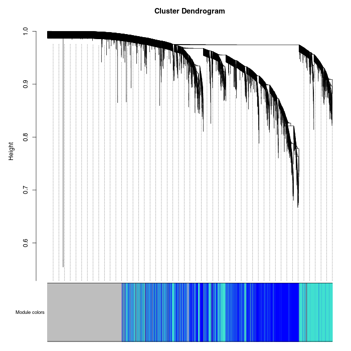

We see several separated by colours modules. The pattern is good so we proceeded with this. 

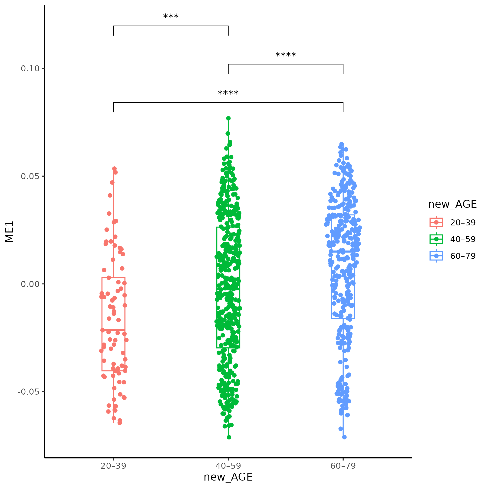

We saw that all three age groups significantly differs one from each other. Therefore there will be findings in modules changes.  

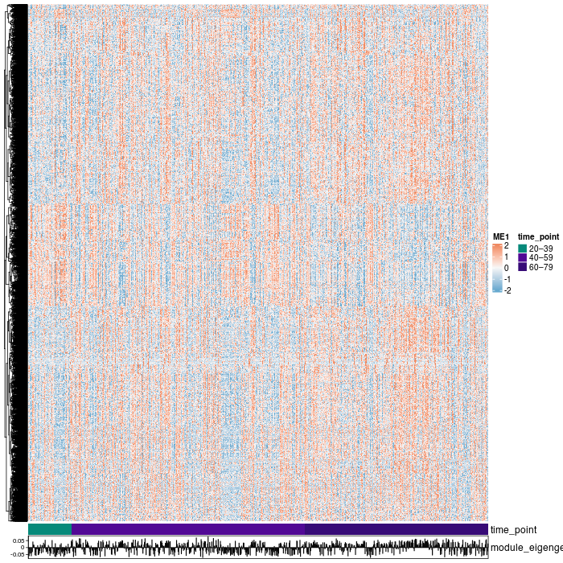

Then we constructed a plot for the most significant module which is ME1. It can be explained by step for mergeCutHeight = 0.2 (so modules are not very accurate), samples are not very homogeneous and etc.  

To identify biological meaning of ME1 we performed GO- and KEGG-enrichment. It showed a focus on neurogenesis (which can be expected since heart is innervated) but also on T-helper cells differentiation and Malaria. It maybe related to the fact that we do not know causes of death of tissue donors from GTEx portal due to ethical reasons. Did they die from malaria? So it causes questions about the reliability of the approach based on this database in the context of ageing studies: if the person died being young, maybe there are important system-wide changes that differ this patient from the healthy ageing person. 

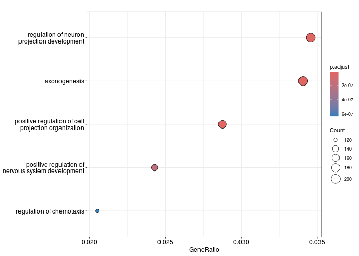
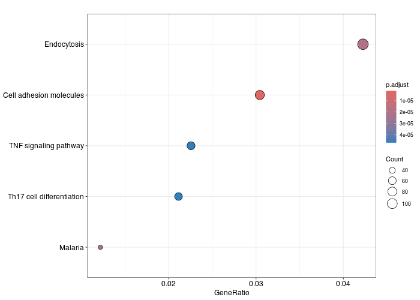

Then we intersected genes in ME1 with matrisome genes and got 143 genes (DCN, VCAN, COL9A2, ELN, COL11A1, NTN1, FBLN1, COL4A4, EPYC, COL16A1, LTBP4, COL9A3, PAPLN, MXRA5, SRPX, COMP, PCOLCE, AEBP1, OGN, ASPN, ECM2, LGI1, COL1A1, TECTA, VWA5A, MGP, COL12A1, COL9A1, SMOC2, IMPG1, SPARC, THBS4, EFEMP1, FN1, PRG4, MFAP2, LTBP2, TNN, TGFBI, CRISPLD1, FMOD, SRGN, TNFAIP6, MATN4, COL21A1, FGL2, COL5A1, LAMA5, EMILIN2, MATN2, POSTN, LAMC1, CHAD, IGFBPL1, EMILIN1, CILP, MMRN1, FRAS1, LUM, KERA, FBLN5, MFAP1, MFGE8, IGFBP4, COL6A1, NTN5, TINAGL1, FNDC7, DPT, HMCN1, ECM1, FBLN7, COL8A1, SLIT2, VWA5B2, HAPLN1, RSPO3, VWDE, IGFBP3, IGFBP1, RSPO2, CRIM1, SPOCK1, IGSF10, LGI2, LGI4, ABI3BP, ACAN, SPON2, CILP2, NTN3, MATN1, NTNG1,SNED1,COL6A3 ,IGFBP7 ,FBLN2 ,PCOLCE2 , ESM1 , BMPER, COL1A2 ,FNDC1 ,SBSPON ,CTHRC1 ,SVEP1, FBN1 , MFAP4, IGFBP6 ,LTBP3 ,TNXB ,COL3A1 ,COL4A3 ,RSPO1, THBS3 ,COL22A1 ,COL24A1 ,COL8A2 ,MMRN2 ,PODN ,BGN , TSKU ,COL18A1 ,SLIT3, NELL2, THBS2, EMID1, HAPLN4, COL14A1,COL4A5, AGRN, PRELP , RELN, NTNG2, COL27A1 ,COL13A1, MFAP5, SMOC1,COL5A2, COL15A1, COL6A6, COL28A1, BGLAP, SPON1). This intersection is not at random according to Chi-square test (p < 0.05). It would be interesting to cross them with researches results devoted to ageing of heart tissues and its extracellular matrix. 

### Liver
The most significant gene module for the Liver samples gave no GO and KEGG biological processes groups and no intersection with matrisome genes.

### Lung
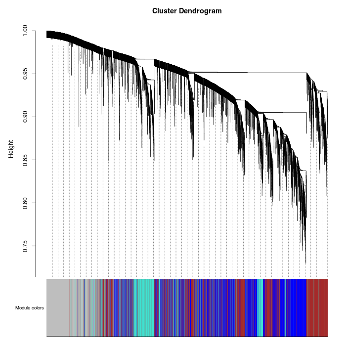

Modules are separated well. 

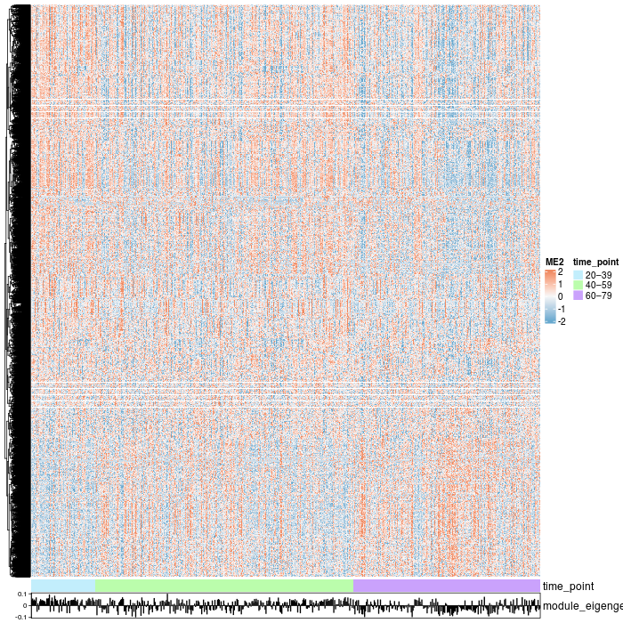

Here we have the same idea of homogeneity for samples. 

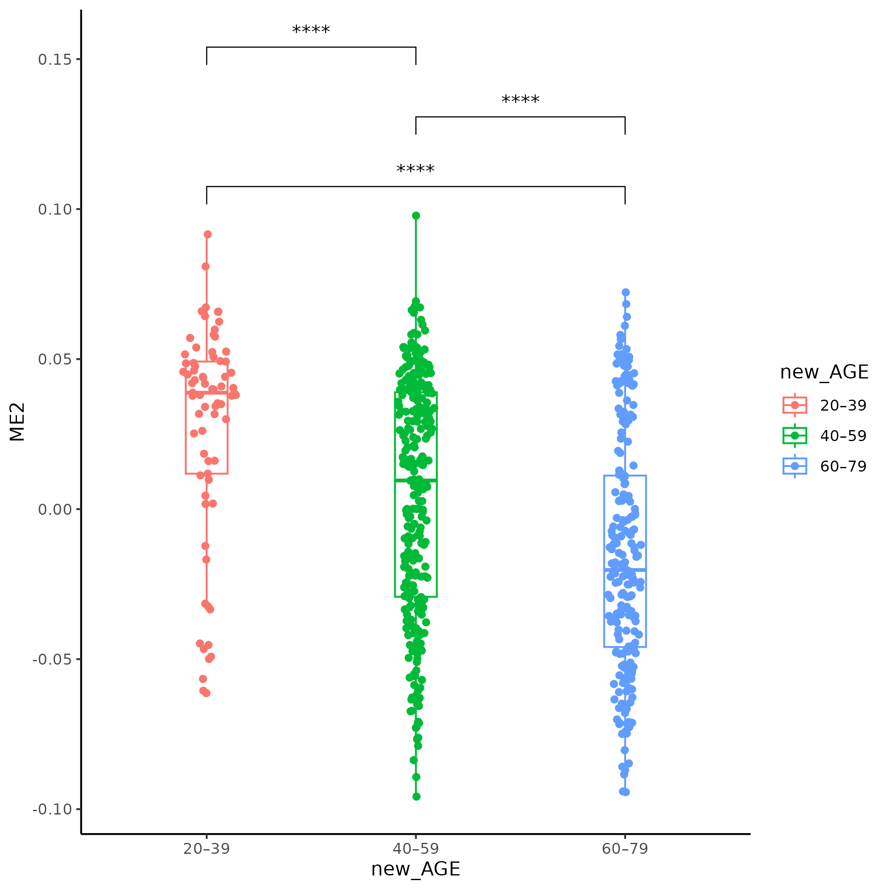

All age groups significantly differs from each other. 

Also GO- and KEGG-enrichment gave more interesting results: during ageing somehow respiration, oxidative phosphorilation and mitochondrial gene expression change. It would be interesting to trace particulas genes of interest associated with such changes and to show their dynamics. Additionally, intersection with matrisome genes list gave 40 genes (IBSP, LAMC3, LAMA3, LAMC2, COL11A1, COL17A1, COL4A4, IGFALS, CHADL, COL20A1, LAMA1, SPOCK2, TECTA, FN1, SPP1, FGL2, LAMA5, MATN3, EMILIN2, KCP, CHAD, MFAP1, FBN3, HAPLN1, VWDE, DMP1, VWA2, COL4A3, RSPO1, LAMB2, NDNF, VWA1, CRELD2, GLDN, DMBT1, EYS, COL4A5, AGRN, NTNG2, LAMB3). This intersection also is not at random according to Chi-square test (p < 0.05). It would be also interesting to find out are there protein coding genes related to cell adjusting cell connections in lungs or maintaining structure of alveoli. 

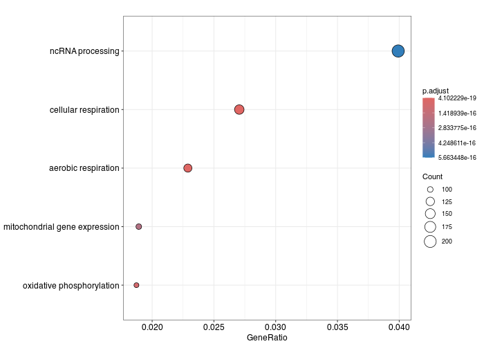
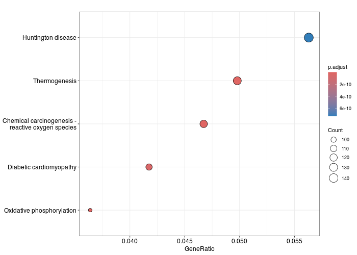

## Discussion

WGCN analysis did not show interesting findings yet. Changes in heart and lung tissues are as they expected to be (but with exceptions). To find gene modules which can be interesting in terms of aging we should use smaller step for gene network construction, more homogeneous samples and dive into identified modules more precisely. Also we may check for other modules and for other samples from this database, repeat the same workflow with more homogeneous samples,intersect matrisome genes with categories in GO/KEGG enrichment, use GO/KEGG groups to compare particular gene expression dynamics through different age, construct regulatory networks to restore molecular mechanisms of agents interactions in modules, check for found matrisome gene functions. Additionally, it would be interesting to follow up particular genes expression through age groups to understand their dynamics.

## Gene expression prediction

### Data analysis

After cleaning the data from unnecessary samples we checked the distribution of gene counts for each gene. The genes were very difference, for some of them median expression was 0.5 counts, for others several thousands.

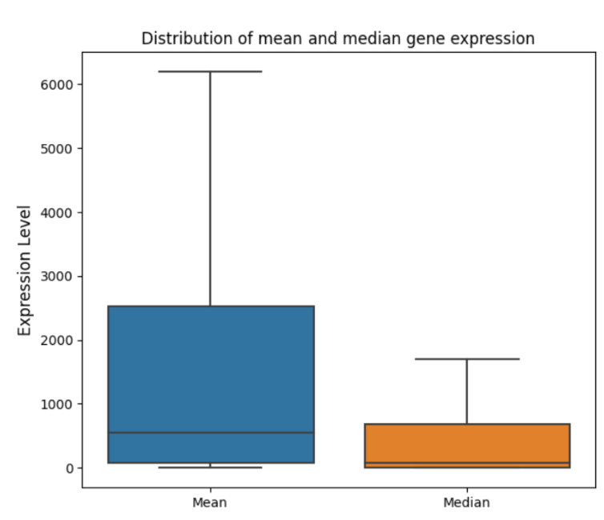

Then we checked correlations between genes and revealed that there are around 5732 correlated pairs (correlation > 0.7)

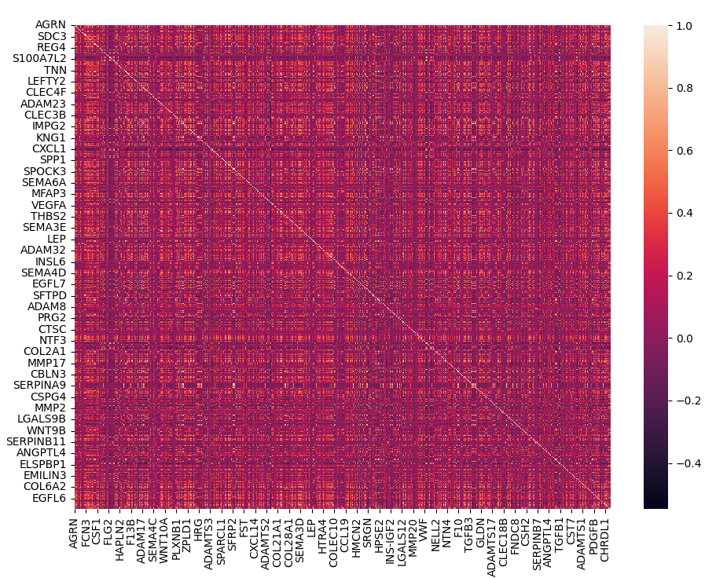

### Regression between gene expression and age

We used stats.linregress to find regression slope and p-value for it between each gene counts and corresponding age. We tried CPM (A), StandarScaler (B) and MinMax normalisations (C), they gave different results.
I think CPM looks strange because we have a lot of outliers in data; StandartScaler felt them too, but MinMax scaler just put all values in [0; 1] range, so it looked better.

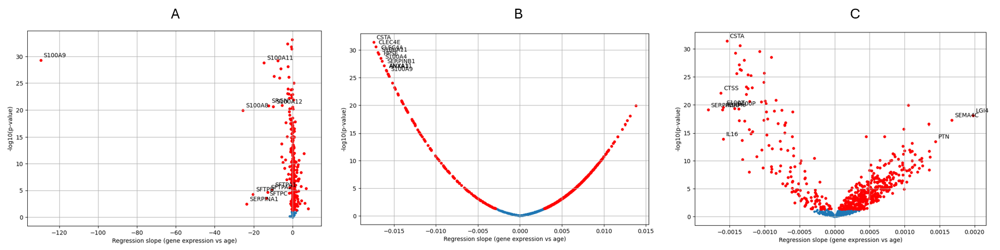

Top10 significant genes with maximum slope related to various functions:

LGI4 Involved in regulation of myelination.

SERPINB8 epithelial desmosome-mediated cell-cell adhesion

SEMA4C cell-cell signaling

CTSS removal of the invariant chain from MHC class II molecules

ADAM8  calcium ion binding and metallopeptidase activity

IL16  pleiotropic cytokine that functions as a chemoattractant, a modulator of T cell activation

S100Z  calcium ion binding

CSTA desmosome-mediated cell-cell adhesion

PTN significant roles in cell growth and survival, cell migration, angiogenesis and tumorigenesis

S100P  calcium sensor and contribute to cellular calcium signaling

### Gene expression prediction

For gene prediction we tried several models: Linear regression, Ridge, Lasso, ElasticNet, KNeighborsRegressor, DecisionTreeRegressor (also RandomForest and XGBoost, but computations took too much time). For scaling I used StandartScaler, hyperarameters were obtain with optuna (3 fold crossvalidation inside)

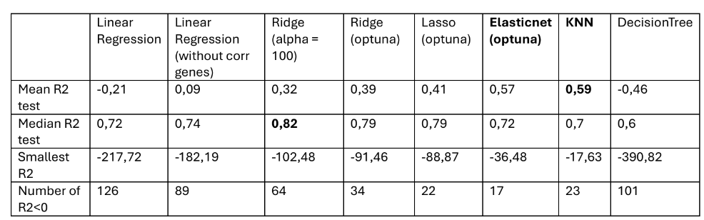

We have chosen R2 as metric, because gene counts are very different and MSE (or RMSE) are not indicative.
For all models we had results with R2 < 0, but the best results related to the median R2 was obtained with Ridge(alpha = 100) for all genes. I think that in this case Ridge just ignored genes with low counts (so the predictions are bad for them), but worked well for genes with high values. However, the best mean R2 result was demonstrated by ElasticNet and KNN. ElasticNet is able to zero out unnecessary features, so it was more sensitive to predictions and predicted genes with a large number of counts worse, but genes with a small number better.

All tables with resulted R2 (train and test), RMSE, mean expression, as well as tables with obtained hyperparameters can be found in gene_prediction/result_tables folder 

Ridge
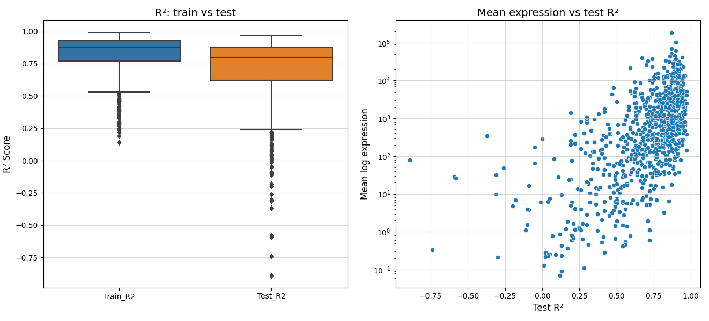
Lasso
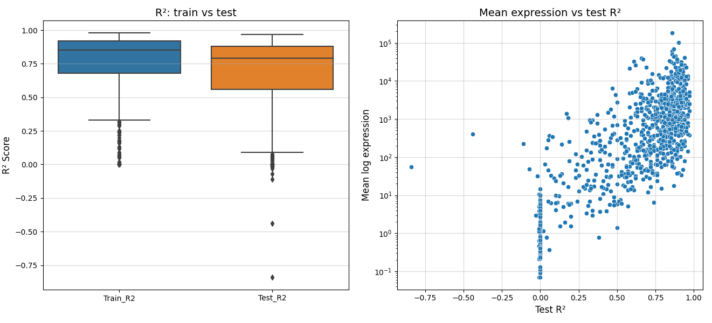
ElasticNet
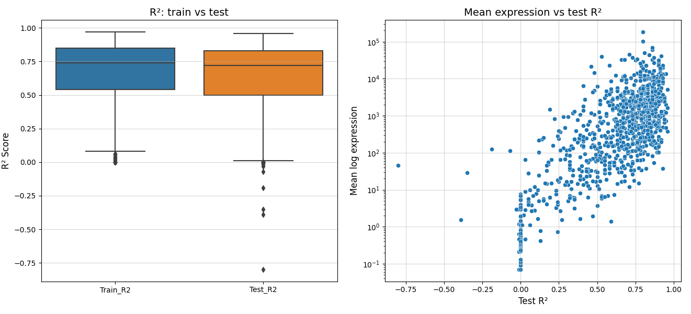
KNN
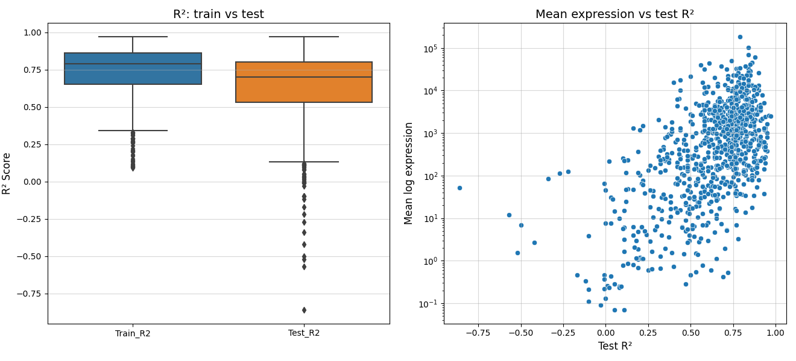
Decision tree
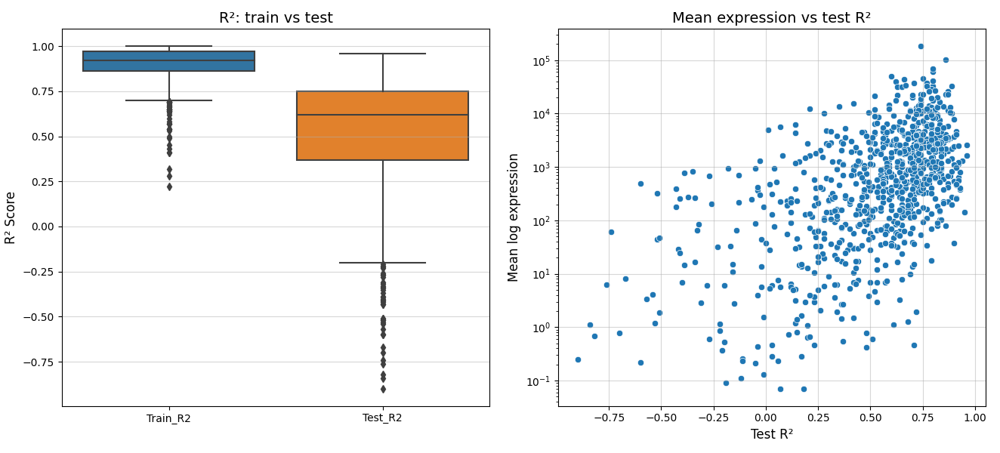

Also as we may see from plots and suspect from the results, typically, for genes with low expression, the prediction is worse than for genes with high expression. And the spearman correlation coefficient (between gene counts and R2) is around 0.6 for all models

## Credits
The part of reproducing the previous analysis was prepared by [Mazalov Aleksei](https://github.com/alex-spalax).

The WGCNA part was prepared by [Shipulina Eva](https://github.com/Vatisinl)

The Gene expression predioction part was prepared by [Malygina Alexandra](https://github.com/Alexandra2022kzn)

## References
1. Guvatova ZG, Kobelyatskaya AA, Kudasheva ER, Pudova EA, Bulavkina EV, Churov AV, Tkacheva ON, Moskalev AA. Matrisome Transcriptome Dynamics during Tissue Aging. Life (Basel). 2024 May 7;14(5):593. doi: 10.3390/life14050593. PMID: 38792614; PMCID: PMC11121957.
2. https://www.gtexportal.org/home/downloads/adult-gtex/bulk_tissue_expression
3. https://storage.googleapis.com/adult-gtex/annotations/v8/metadata-files
4. MatrisomeDB: 2023 updates of the ECM protein knowledge database. Shao X, Gomez CD, Kapoor N, Considine JM, Gao Y, Naba A. Nucleic Acids Research, 2022, gkac1009. doi.org/10.1093/nar/gkac1009
5. Robinson MD, McCarthy DJ, Smyth GK. edgeR: a Bioconductor package for differential expression analysis of digital gene expression data. Bioinformatics. 2010 Jan 1;26(1):139-40. doi: 10.1093/bioinformatics/btp616. Epub 2009 Nov 11. PMID: 19910308; PMCID: PMC2796818.
6. https://www.genecards.org/ (for information about genes)
